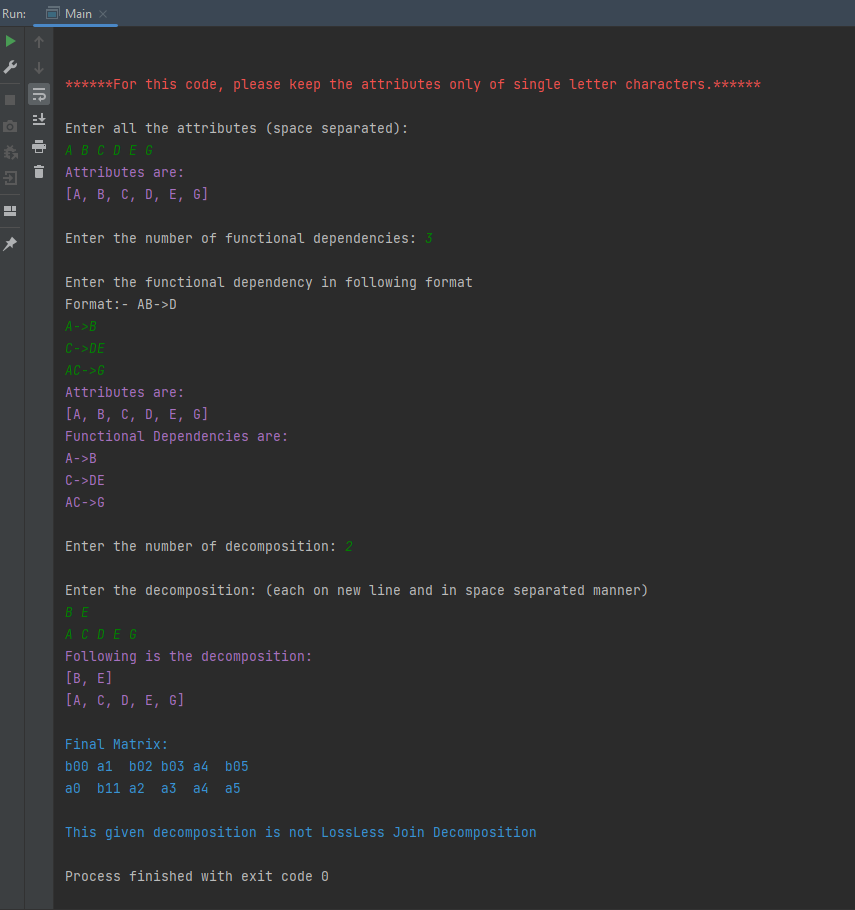
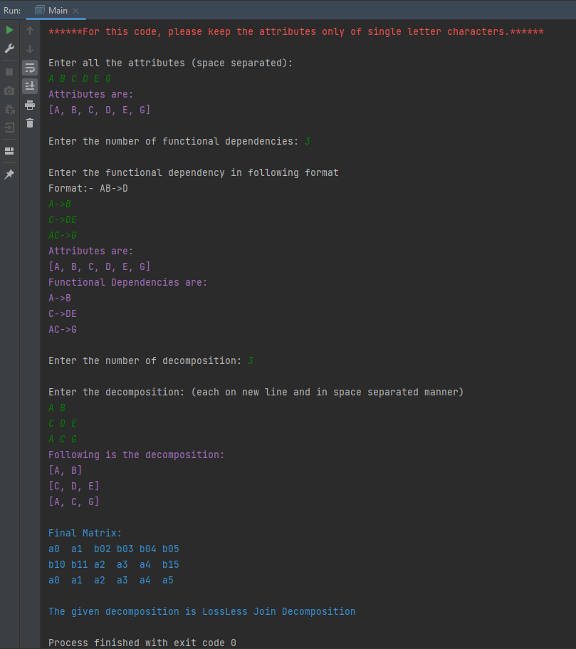

# Lossless Join Testing

----

## Algorithm:

**Input:** A universal relation R, a decomposition D = {R1, R2, ..., Rm} of R, 
and a set F of functional dependencies.

    1. Create an initial matrix S with one row i for each relation Ri in D, and one column j for each attribute Aj in R.
    2. Set S(i,j):= bij for all matrix entries. (* each bij is a distinct symbol associated with indices (i,j)*).
    3. For each row i representing relation schema Ri
        {
            For each column j representing attribute Aj
            {
                If(relation Ri includes attribute Aj)
                {
                    Set S(i,j):= aj;
                }
            }

        }
    4. Repeat the following loop until a complete loop execution results in no changes to S
        {
            For each functional dependency X -> Y in F
            {
                For all rows in S which have the same symbols in the columns corresponding to attributes in X
                {
                    Make the symbols in each column that correspond to an attribute in Y be the same in all these rows as follows:
                        If any of the rows has an "a" symbol for the column, set the other rows to that same "a" symbol in the column.
                        If no "a" symbol exists for the attribute in any of the rows, choose one of the "b" symbols that appear in one
                        of the "b" symbols that appear in one of the rows for the attribute and set the other rows to that same "b" symbol in the column;
                }
            }
        }
    5. If a row is made up entirely of "a" symbols, then the decomposition has the losslss join property, otherwise it does not.

## Input format for the given code:
1. Enter all the attributes of the given relation in a space separated manner. For this code please adhere to single letter characters.
2. Enter the number of functional dependencies.
3. Enter the functional dependency in the format: AB->C, B->DEF, etc.
4. Enter the number of decompositions.
5. Enter the decomposition, each decomposition on a new line and attributes be space separated.

## Output format:
1. Final matrix is shown.
2. A verdict showing the decomposition is lossless or not.

## Screenshot of output:
1. Not A lossless Join Decomposition 
2. A lossless Join Decomposition 